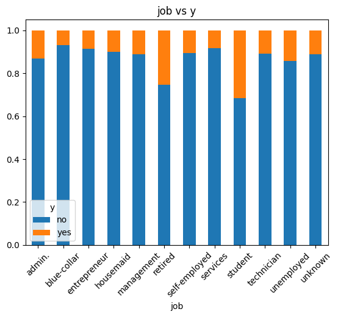

[README.md](https://github.com/user-attachments/files/24785506/README.md)
## Telco Customer Churn – Exploratory Data App
Aplicación interactiva desarrollada en Streamlit para explorar los factores que influyen en la aceptación de campañas de marketing. El proyecto incluye análisis exploratorio, visualizaciones dinámicas y conclusiones basadas en los principales hallazgos del dataset.
---

###  Descripción del proyecto
Este proyecto analiza los factores que influyen en la aceptación de una campaña de marketing, utilizando un dataset real y técnicas de análisis exploratorio. La aplicación permite:
 - Visualizar distribuciones y relaciones entre variables.
 - Identificar patrones asociados a la aceptación de la campaña.
 - Explorar perfiles de clientes y variables macroeconómicas.
 - Generar insights clave para la toma de decisiones comerciales.
---

### Hallazgos principales:
1. 	La duración de la llamada es el factor más asociado a la aceptación.
2. 	El canal celular es más efectivo que el teléfono fijo.
3. 	Clientes contactados recientemente (pdays bajos) responden mejor.
4. 	Las variables macroeconómicas influyen en la aceptación.
5. 	El perfil del cliente (job, education) afecta la probabilidad de éxito.
---

## Visualizaciones principales
---

### Distribución por edad

---

### Distribución por trabajo

---

### Trabajo vs variable objetivo

